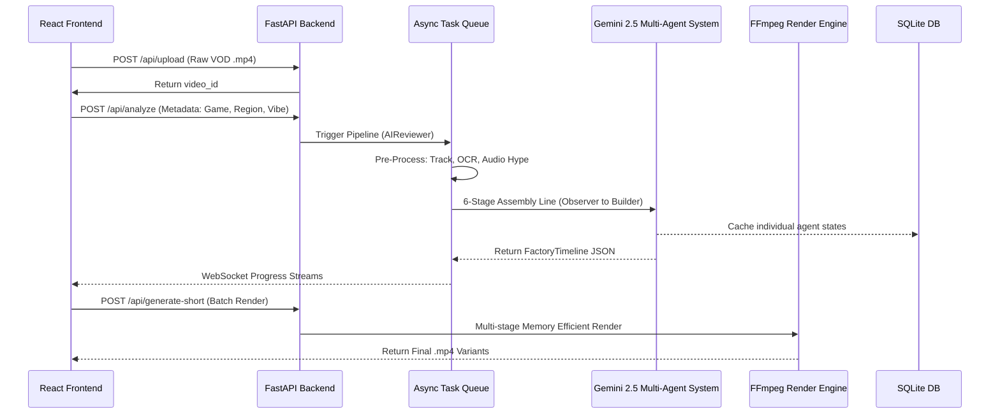

# Antigravity System Architecture

The Antigravity Shorts Engine is architected to safely process massive amounts of video data by cleanly separating state, orchestration, and intense background computation.

## Architectural Boundary & Environment
**CRITICAL RULE:** The project is strictly separated into a Python/FastAPI backend and a React/Vite frontend. The Backend handles all computationally expensive ML and FFmpeg tasks asynchronously, while the Frontend strictly manages state and user configuration.

## Core Flow Architecture

## 1. Frontend Layer
The React frontend is a stateless client. It never manipulates media directly. It submits triggers and then opens WebSockets (`ws://`) to stream the stdout logs of the backend workers in real-time, providing immediate feedback to the user without blocking the browser.

## 2. API & Orchestration Layer
FastAPI manages the database (`SQLite`) and spins up `asyncio` background tasks. The most critical component here is the **Redrive Engine**. Every AI agent interaction is independently logged in the database. If an LLM rate-limit occurs, the API gracefully handles it using a `tenacity` exponential backoff algorithm. If the server goes down, the orchestrator resumes the job exactly where it crashed.

## 3. The 6-Agent AI Layer
A Directed Acyclic Graph (DAG) pipeline. To prevent "Lost in the Middle" LLM amnesia, the system passes highly specific, decoupled context:
1. Observer produces raw JSON timestamps.
2. Scriptwriter reads Observer and creates phases.
3. Director reads Observer and dictates the overall video vibe.
4. Editor merges the phases and the vibe to create the technical breakdown.
5. Specialist calculates exact frame arithmetic.
6. Builder takes ONLY the Specialist's output to format final JSON.
The pipeline relies completely on deterministic pre-processors (Audio Hype Map, OCR, YOLOv8) to provide a ground-truth Context Engine before sending a single prompt to Gemini.

## 4. Execution Engine Layer
FFmpeg is notoriously prone to memory leaks on massive filter graphs. Instead of building one giant string, the pipeline executes a multi-stage process:
1. It precisely snaps visual cuts to the nearest preceding I-Frame (Keyframe) for instantaneous stream copying and prevents audio desync.
2. It processes clips concurrently using `ProcessPoolExecutor` for optimal core utilization.
3. It runs **Demucs** to physically separate the vocal stem from game audio.
4. It mixes ducked audio (driving background music exclusively against the isolated vocal track) and applies LUFS (-14) normalization.
5. It runs a Headless Node.js Compositor using Puppeteer to generate a dynamic `.webm` subtitle track with alpha transparency, then overlays it in the final fast-pass.
