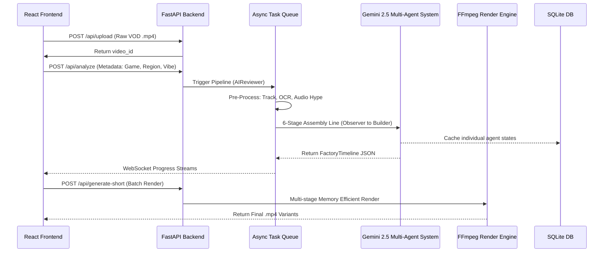

# Antigravity System Architecture

The Antigravity Shorts Engine is architected to safely process massive amounts of video data by cleanly separating state, orchestration, and intense background computation.

## Architectural Boundary & Environment
**CRITICAL RULE:** The project is strictly separated into a Python/FastAPI backend and a React/Vite frontend. The Backend handles all computationally expensive ML and FFmpeg tasks asynchronously, while the Frontend strictly manages state and user configuration.

## Core Flow Architecture

## 1. Frontend Layer
The React frontend is a stateless client. It never manipulates media directly. It submits triggers and then opens WebSockets (`ws://`) to stream the stdout logs of the backend workers in real-time, providing immediate feedback to the user without blocking the browser.

## 2. API & Orchestration Layer
FastAPI manages the database (`SQLite`) and spins up `asyncio` background tasks. The most critical component here is the **Redrive Engine**. Every AI agent interaction is independently logged in the database. If an LLM rate-limit occurs, the API can resume the job exactly where it crashed.

## 3. The 6-Agent AI Layer
A linear pipeline (`Observer -> Scriptwriter -> Director -> Editor -> Specialist -> Builder`). The pipeline relies completely on deterministic pre-processors (Audio Hype Map, OCR, YOLOv8) to provide a ground-truth Context Engine before sending a single prompt to Gemini.

## 4. Execution Engine Layer
FFmpeg is notoriously prone to memory leaks on massive filter graphs. Instead of building one giant string, the pipeline executes a multi-stage process:
1. It slices the video and applies independent color grading/panning filters per clip concurrently using `ThreadPoolExecutor`.
2. It stitches them together chronologically with `xfade`.
3. It mixes ducked audio and applies WhisperX `.ass` captions in the final fast-pass.
