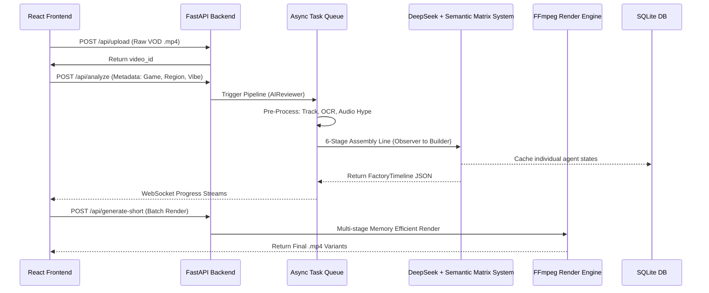

# Antigravity System Architecture

The Antigravity Shorts Engine is architected to safely process massive amounts of video data by cleanly separating state, orchestration, and intense background computation.

## Architectural Boundary & Environment
**CRITICAL RULE:** The project is strictly separated into a Python/FastAPI backend and a React/Vite frontend. The Backend handles all computationally expensive ML and FFmpeg tasks asynchronously, while the Frontend strictly manages state and user configuration.

## Core Flow Architecture

## 1. Frontend Layer
The React frontend is a stateless client. It never manipulates media directly. It submits triggers and then opens WebSockets (`ws://`) to stream the stdout logs of the backend workers in real-time, providing immediate feedback to the user without blocking the browser.

## 2. API & Orchestration Layer
FastAPI manages the database (`SQLite`) and spins up `asyncio` background tasks. The most critical component here is the **Redrive Engine**. Every AI agent interaction is independently logged in the database. If an LLM rate-limit occurs, the API gracefully handles it using a `tenacity` exponential backoff algorithm. If the server goes down, the orchestrator resumes the job exactly where it crashed.

## 3. The 6-Agent AI Layer
A Directed Acyclic Graph (DAG) pipeline. To prevent "Lost in the Middle" LLM amnesia, the system passes highly specific, decoupled context:
1. Observer produces raw JSON timestamps.
2. Scriptwriter reads Observer and creates phases.
3. Director reads Observer and dictates the overall video vibe.
4. Editor merges the phases and the vibe to create the technical breakdown.
5. Specialist calculates exact frame arithmetic.
6. Builder takes ONLY the Specialist's output to format final JSON.
The pipeline relies completely on deterministic pre-processors (Audio Hype Map, OCR, YOLOv8) and the `SemanticMatrixBuilder` (AST Audio + SigLIP + Optical Flow) to provide a ground-truth Context Engine before sending a single prompt to DeepSeek.

## 4. Asset Engine Layer (Bootstrapping & JIT)
The pipeline employs a **Two-Tier Asset Strategy** to bypass heavy vector database dependencies:
1. **Local Cache & BM25 Matcher**: A local `/assets/` directory seeded with high-quality CC0 `wav` files. The system utilizes a lightweight Python `SequenceMatcher` to calculate token-overlap between AI semantic requests and the `asset_manifest.json`.
2. **JIT API Fetcher**: If the semantic match score drops below 0.4, the system triggers a Just-In-Time REST query to the FreeSound API, strictly filtering by CC0, and seamlessly streams the asset down to the FFmpeg engine instantly.

## 5. Execution Engine Layer (Elite Tier)
FFmpeg is notoriously prone to memory leaks on massive filter graphs. Instead of building one giant string, the pipeline executes a hyper-optimized multi-stage process:
1. **The Padded Clip Strategy ("Handles")**: It precisely snaps visual cuts to the nearest I-Frame, but adds a mathematically perfect 3-second temporal buffer to both sides of the clip.
2. **Micro-Targeted Audio Separation**: It runs **Demucs** ONLY on these padded 15s micro-chunks synchronously, completely bypassing the massive I/O bottleneck of separating a full 1-hour VOD.
3. **Flawless Stitching Matrix**: The engine runs 1.0s `acrossfade` transitions strictly on the overlapping background stems, while hard-cutting the isolated dialogue stems, resulting in a continuous broadcast audio bed without pops.
4. **Platform-Native Hardware Encoding**: A dynamic `get_encoder_profile()` fallback wrapper detects and executes `h264_nvenc` via host passthrough for lightning-fast GPU-accelerated rendering.
5. **Headless Compositor**: A Puppeteer Node.js service overlays dynamic `webm` captions.
6. **Automated Structural QA Gate**: Before returning to the UI, the pipeline runs a rigorous gate logic using `ffprobe` to validate stream structure and `cv2` (OpenCV) frame-variance sampling to catch and automatically redrive frozen or pure black renders.
