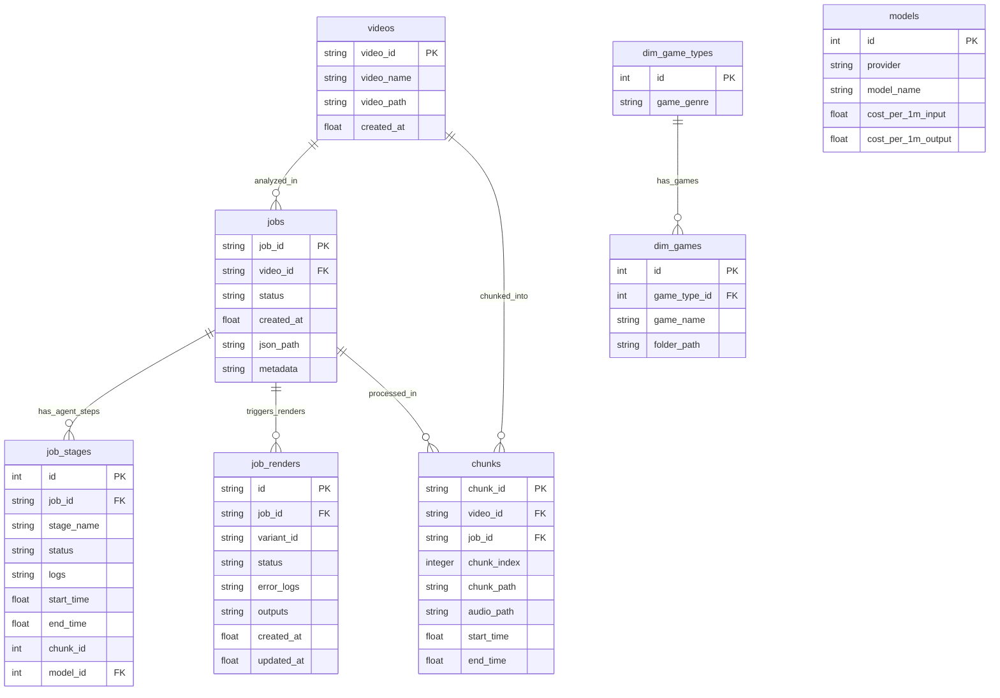

# Database Schema & State Mapping

The Database layer governs state persistence for physical video files, asynchronous analysis jobs, and background FFmpeg rendering tasks.

## Architectural Boundary & Environment
**CRITICAL RULE:** The database uses SQLite (`backend/core/db/schema.sql`). It is intentionally kept lightweight and purely relational. It acts as the backbone for the Redrive Engine—allowing jobs to gracefully recover from LLM rate limits without wasting tokens.

**Concurrency Configuration:** To support asynchronous parallel rendering and multi-agent jobs without locking the database, the SQLite connections (`backend/core/db/connection.py`) are configured with `check_same_thread=False`, `timeout=15.0`, and strictly use `PRAGMA journal_mode=WAL;` (Write-Ahead Logging).

**The DB Manager Pattern:** Raw SQL execution is strictly forbidden in application code. All interactions must go through the centralized `core.db.manager.db` singleton, which provides nested domain managers like `db.videos`, `db.jobs`, and `db.games`.

## Schema Architecture

## 1. The Videos, Chunks and Jobs Tables
- **`videos`**: Acts as the physical asset registry. It purely tracks what exists in the `workspace/videos` directory.
- **`chunks`**: Registers heavily overlapping video and audio segments sliced from the main VOD to prevent processing the entire file at once.
- **`jobs`**: The overarching session controller. The `metadata` column stores the global context (Game ID, Player Skill, Region) that the user configures in the React UI.

## 2. Game Context Architecture
- **`dim_game_types`**: Stores the high-level genres (FPS, MOBA, BR, etc.).
- **`dim_games`**: Stores the actual game titles mapped to their genres. Also stores a `folder_path` pointing to a physical text file where custom lore and context is written.

## 3. Granular State Tracking (`job_stages`)
This is the most critical table for the backend. Because the pipeline splits a 10-minute video into multiple overlapping chunks, and then runs 6 distinct agents per chunk, we track state at the `(job_id, chunk_id, stage_name)` grain. 

## 4. The Redrive Engine (Token Conservation)
When the React UI triggers `POST /api/orchestrator/redrive/{job_id}` after a DeepSeek timeout:
1. The backend queries all `completed` rows from `job_stages`.
2. It reads the physically cached JSON files from `outputs/agents/{job_id}/`.
3. It rebuilds the Python `resume_state` dictionary entirely from the database and cache.
4. The orchestrator loop skips any stage that exists in the `resume_state`, instantly picking up exactly where it failed without making duplicate LLM calls.
