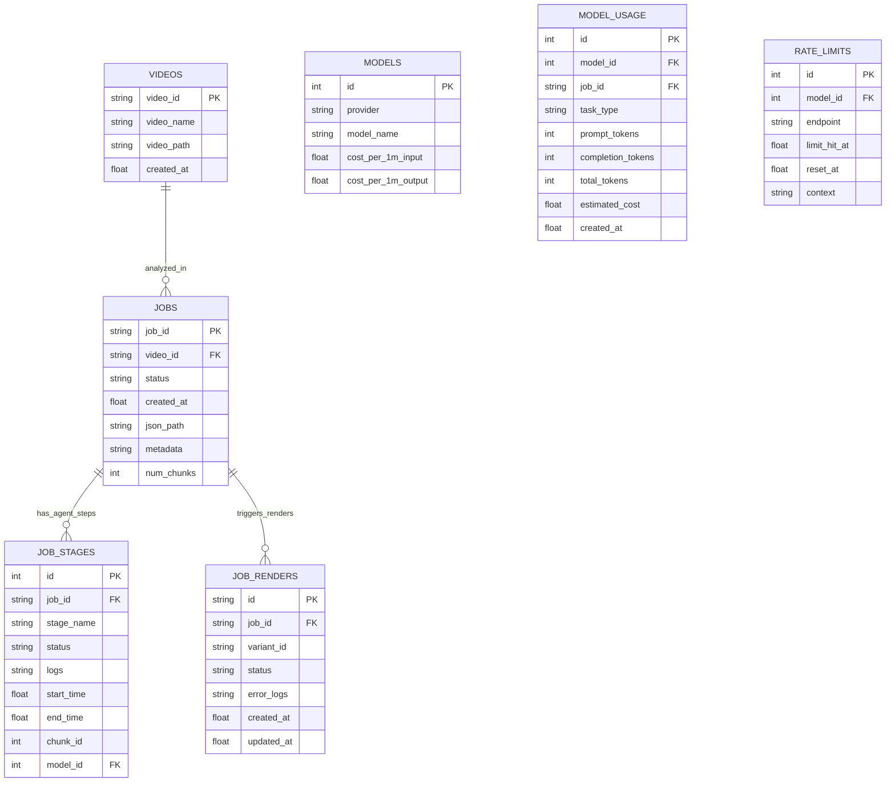

# Database Schema & State Mapping

The Database layer governs state persistence for physical video files, asynchronous analysis jobs, and background FFmpeg rendering tasks.

## Architectural Boundary & Environment
**CRITICAL RULE:** The database uses SQLite (`backend/database.py`). It is intentionally kept lightweight and purely relational. It acts as the backbone for the Redrive Engine—allowing jobs to gracefully recover from LLM rate limits without wasting tokens.

## Schema Architecture

## 1. The Videos and Jobs Tables
- **`videos`**: Acts as the physical asset registry. It purely tracks what exists in the `workspace/` directory.
- **`jobs`**: The overarching session controller. The `metadata` column stores the global context (Game, Vibe, Region) that the user configures in the React UI.

## 2. Granular State Tracking (`job_stages`)
This is the most critical table for the backend. Because the pipeline splits a 10-minute video into multiple overlapping chunks, and then runs 6 distinct agents per chunk, we track state at the `(job_id, chunk_id, stage_name)` grain. Each stage is directly linked to the specific LLM used via the `model_id` foreign key.

## 3. Cost & Rate Limit Monitoring
To accurately track LLM consumption across Gemini and DeepSeek:
- **`models`**: Tracks provider information and dynamic pricing tiers per 1M tokens.
- **`model_usage`**: Logs every generated completion along with token counts and calculated cost per job task.
- **`rate_limits`**: Persists HTTP 429 timeouts to provide backoff transparency to the orchestrator.

## 3. The Redrive Engine (Token Conservation)
When the React UI triggers `POST /api/redrive/{job_id}` after a Gemini timeout:
1. The backend queries all `completed` rows from `job_stages`.
2. It reads the physically cached text files from `outputs/agents/{job_id}/{chunk_id}/{stage_name}.txt`.
3. It rebuilds the Python `resume_state` dictionary entirely from the database and cache.
4. The orchestrator loop skips any stage that exists in the `resume_state`, instantly picking up exactly where it failed without making duplicate LLM calls.

## 4. Admin Diagnostics
The API exposes `GET /api/db/dump` to serialize these tables directly into the Frontend's Database Viewer component for real-time debugging. A `clear_database()` hook is also provided to safely nuke tables and cleanly wipe all `.mp4` caches.
