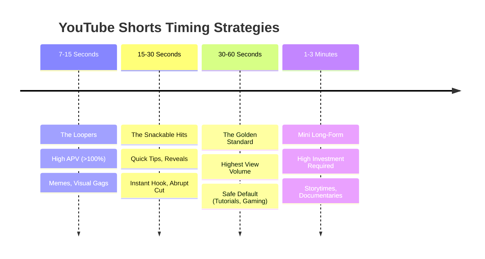

# YouTube Shorts Algorithm Guide

While YouTube recently bumped the maximum length for Shorts all the way up to 3 minutes, the "perfect" timing isn't about using all that space. The algorithmic sweet spot for the vast majority of high-performing Shorts right now sits right between 20 and 45 seconds.

## Architectural Boundary & Environment
**CRITICAL RULE:** The AI Builder Agent must structurally enforce these temporal limitations. Any variant output by the pipeline must accurately calculate the sum of its phase durations to fit within the intended zone, avoiding filler and bloated segments.

## Algorithmic Timing Zones

## 1. The 7 to 15-Second Zone (The Loopers)
- **Best for**: Memes, visual gags, satisfying moments, and punchline humor.
- **The Strategy**: At this length, the algorithm expects your video to be looped. To go viral here, your Average Percentage Viewed (APV) often needs to exceed 100% (meaning people watch it, finish it, and watch it again without swiping).

## 2. The 15 to 30-Second Zone (The Snackable Hits)
- **Best for**: Quick tips, before-and-after reveals, and product teasers.
- **The Strategy**: This is perfect for single-idea videos. You hook the viewer in the first 3 seconds, deliver the value instantly, and cut the video the millisecond the tip is over. No intros, no outros.

## 3. The 30 to 60-Second Zone (The Golden Standard)
- **Best for**: Tutorials, gaming highlights, top-5 lists, and talking-head advice.
- **The Strategy**: Data shows that Shorts in the 50–60 second range actually pull in significantly more views than sub-10-second clips. This is because YouTube values total watch time combined with completion rate. This is the safest default length for most creators.

## 4. The 1 to 3-Minute Zone (Mini Long-Form)
- **Best for**: Deep educational content, storytimes, and mini-documentaries.
- **The Strategy**: Only use this if your topic cannot possibly be compressed. The algorithm requires a heavily invested audience to stick around for 2 minutes on a vertical feed, so your visual pacing (changing the camera angle or throwing up text every 3-5 seconds) must be flawless.

## The "Stop and Hold" Rule
Ultimately, there is no magic number. A perfect Short wins twice: it gets the viewer to stop scrolling in the first 3 seconds, and it holds them until the very last frame. If you stretch a 20-second idea into a 50-second video, viewers will swipe away, and the algorithm will kill the video's reach.

---
**Agent Directive**: 
When extracting gaming videos for the Antigravity pipeline, always target the **Golden Standard (30-60 Seconds)**. Ensure the combined lengths of the Proposition, Struggle, and Result perfectly sum up to this algorithmic sweet spot, without any filler that destroys the "Stop and Hold" rule.
